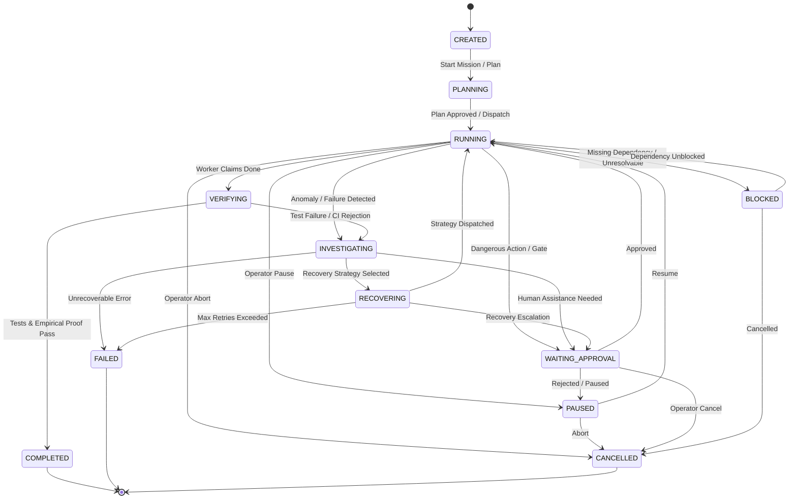

# AI Work Supervisor — Mission Control Plane Architecture (Phase 7)

## 1. Overview & Control Plane Topology

Phase 7 elevates the **SupervisorEngine** into a centralized, production-grade **Mission Control Plane**. In this architecture, the Supervisor acts as the supreme control authority governing multiple missions and multi-agent teams without cross-contamination.

```
                         ┌───────────────────────┐
                         │   HUMAN OPERATOR /    │
                         │   SUPERVISOR UI       │
                         └───────────┬───────────┘
                                     │ Human Decisions / Overrides
                                     ▼
                         ┌───────────────────────┐
                         │   MISSION CONTROL     │
                         │   PLANE (Supervisor)  │
                         └───────────┬───────────┘
                                     │
         ┌──────────────┬────────────┼────────────┬──────────────┐
         ▼              ▼            ▼            ▼              ▼
   ┌───────────┐  ┌───────────┐┌───────────┐┌───────────┐  ┌────────────┐
   │  PLANNER  │  │ WORKER A  ││ WORKER B  ││ REVIEWER  │  │  VERIFIER  │
   │ Decomposes│  │ Implements││ Implements││ Audits    │  │ Test & CI  │
   │ Goal DAG  │  │ Code/Docs ││ Code/Docs ││ Diffs     │  │ Evidence   │
   └───────────┘  └───────────┘└───────────┘└───────────┘  └────────────┘
```

The Supervisor does not write application code; instead, it observes, guides, mediates conflicts, gates risky operations behind human approval, and verifies empirical completion.

---

## 2. Mission Lifecycle

Each mission executes through a strict, deterministic state machine with validated transitions.

### 2.1 State Flow



### 2.2 Transition Rules Table

| Current Status | Permitted Next States |
| :--- | :--- |
| `CREATED` | `PLANNING`, `RUNNING`, `CANCELLED` |
| `PLANNING` | `RUNNING`, `PAUSED`, `WAITING_APPROVAL`, `CANCELLED`, `FAILED` |
| `RUNNING` | `PAUSED`, `INVESTIGATING`, `VERIFYING`, `WAITING_APPROVAL`, `BLOCKED`, `COMPLETED`, `FAILED`, `CANCELLED` |
| `PAUSED` | `RUNNING`, `INVESTIGATING`, `CANCELLED` |
| `INVESTIGATING` | `RECOVERING`, `WAITING_APPROVAL`, `PAUSED`, `FAILED`, `CANCELLED` |
| `RECOVERING` | `RUNNING`, `INVESTIGATING`, `WAITING_APPROVAL`, `PAUSED`, `FAILED`, `CANCELLED` |
| `VERIFYING` | `COMPLETED`, `INVESTIGATING`, `FAILED`, `CANCELLED` |
| `WAITING_APPROVAL` | `RUNNING`, `PAUSED`, `CANCELLED`, `FAILED` |
| `BLOCKED` | `RUNNING`, `CANCELLED`, `FAILED` |
| `COMPLETED` | *(Terminal)* |
| `FAILED` | *(Terminal)* |
| `CANCELLED` | *(Terminal)* |

Invalid transitions trigger a `ValueError` at the `MissionManager` boundary, preventing mission state corruption.

---

## 3. Agent Registry

The `AgentRegistry` (`agents/registry.py`) provides real-time lifecycle tracking of all active agents across the control plane.

### 3.1 Tracked Attributes

* `agent_id`: Unique identifier (e.g., `planner_01`, `worker_backend_02`).
* `agent_type`: Standardized role — `PLANNER`, `WORKER`, `REVIEWER`, `VERIFIER`, `SUPERVISOR`.
* `mission_id`: Bound mission boundary (enforces isolation).
* `task_id` / `current_task`: Active assigned task.
* `model`: LLM model designation (e.g. `nemotron`, `deepseek`).
* `status`: `IDLE`, `RUNNING`, `WAITING`, `INVESTIGATING`, `PAUSED`, `RECOVERING`, `COMPLETED`, `FAILED`.
* `iterations`: Count of execution cycles executed.
* `tool_calls`: Cumulative tool invocations.
* `interventions`: Number of supervisor interventions directed at this agent.
* `health`: `HEALTHY`, `DEGRADED`, `ANOMALOUS`, `OFFLINE`.
* `last_activity`: UTC timestamp of latest event received.

### 3.2 Contention & Multi-Agent Coordination

* **Scoped File Locks**: Detects and reports file access contention if two workers attempt concurrent edits to overlapping files.
* **Granular Worker Control**: The Supervisor engine registers worker instances (`DummyWorker` or subclasses implementing `pause()` / `resume()`), permitting individual workers to be paused for approvals without halting other agents on orthogonal DAG tasks.

---

## 4. Human Intervention & Safety Gates

Human operators possess supervisory override authority at all times.

### 4.1 Supported Interventions

1. **`REQUEST_APPROVAL`**: Triggered when an agent attempts a high-risk tool call (e.g., `rm -rf`, modifying protected configuration, schema drops). Agent enters pause state.
2. **`TAKE_CONTROL`**: Operator asserts direct manual control; mission is moved to `PAUSED` and human instructions take precedence.
3. **`PAUSE`**: Freezes current task execution and worker instances cleanly.
4. **`RESUME`**: Unfreezes paused worker instances with updated context or guidance.
5. **`CANCEL`**: Safely terminates the mission, canceling any pending approval requests and stopping workers.
6. **`HUMAN_REQUIRED`**: Triggered when autonomous recovery has exhausted its retry budget or encountered unresolvable CI errors; moves mission to `WAITING_APPROVAL`.

### 4.2 Non-Negotiable Safety Invariants

> [!CAUTION]
> **Absence of Response is Never Approval.**
> If an approval request has not received an explicit resolution from an operator, it remains strictly `PENDING`. Agents are never unblocked based on timeouts or assumed consent.

Resolutions must be explicit:
* `APPROVE_ONCE`: Authorizes the single requested execution.
* `APPROVE_ALWAYS`: Whitelists the action pattern for subsequent runs in this mission.
* `REJECT`: Denies execution and returns feedback to the agent.
* `CANCEL`: Aborts the pending approval request.

---

## 5. Mission Telemetry

The `TelemetryTracker` (`supervisor/telemetry.py`) provides unified metrics across four dimensions:

### 5.1 Telemetry Categories

* **Execution Telemetry**:
  * Total runtime seconds
  * Step / iteration count
  * Tool calls executed
  * Completed and failed tasks
  * **Per-agent breakdown**: Dedicated metrics per agent ID
* **Reliability Telemetry**:
  * Cumulative failure count
  * Repeated failure count (loop detection signals)
  * Supervisor interventions
  * Autonomous recovery attempts
  * Verification rejections
* **Risk Telemetry**:
  * Dangerous actions detected
  * Scope boundary violations
  * Approval requests created
  * Blocked tool invocations
* **CI Telemetry**:
  * External Jenkins builds triggered
  * Build failures
  * Test execution failures parsed from JUnit XML

### 5.2 Token & Cost Accuracy Rule

> [!IMPORTANT]
> **No Fabricated Costs.**
> If the underlying model provider or mock executor does not expose actual token consumption and costs, telemetry reports `0.0`. Fake or assumed estimates are never generated.

---

## 6. REST API & WebSocket Event Stream

The FastAPI control plane (`apps/api/main.py`) exposes endpoints for dashboard and CLI consumption:

### 6.1 Endpoints

| Method | Path | Description |
| :--- | :--- | :--- |
| `POST` | `/api/missions` | Create a new mission |
| `GET` | `/api/missions/{id}/state` | Get consolidated mission state, tasks, agents, and approvals |
| `POST` | `/api/missions/{id}/status` | Validate and execute lifecycle status transition |
| `POST` | `/api/tasks` | Create task and append to mission DAG |
| `POST` | `/api/tasks/{id}/status` | Transition task status |
| `POST` | `/api/agents` | Register agent into the central registry |
| `POST` | `/api/agents/{id}/state` | Update agent status, current task, or health |
| `GET` | `/api/approvals` | List pending approval requests |
| `POST` | `/api/approvals` | Create approval request for risky action |
| `POST` | `/api/approvals/{id}/resolve`| Operator approval resolution (`APPROVE_ONCE`, etc.) |
| `GET` | `/api/supervisor/events` | Query audit log with type/severity/mission filters |
| `GET` | `/api/telemetry/mission/{id}`| Fetch structured 4-quadrant telemetry |
| `WS` | `/ws/events` | Real-time WebSocket event stream with keepalive pong |

---

## 7. Zero Cross-Mission Contamination

The control plane enforces complete multi-tenancy isolation:
1. **Per-Mission State Machines**: Each mission maintains its own `SupervisorStateMachine` instance.
2. **Filtered Queries**: Telemetry, events, and task managers filter strictly by `mission_id`.
3. **Agent Segregation**: Agents bound to Mission A cannot read locks, execute tasks, or mutate memory of Mission B.
