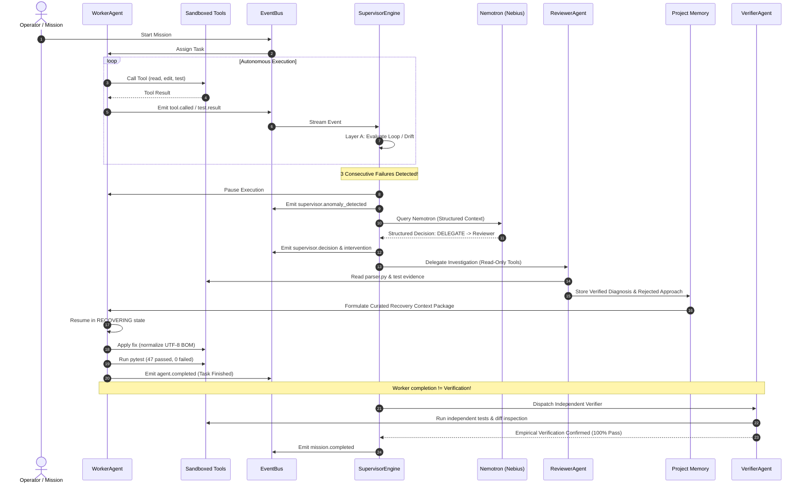

# Phase 2, 3 & 4 Real Implementation Architecture

## 1. System Overview

The AI Work Supervisor turns autonomous agent operations into a supervised, self-healing loop.

---

## 2. Worker Lifecycle & Tool Execution (Phase 2)

- **Worker States**: `IDLE` -> `RUNNING` -> `WAITING` -> `PAUSED` -> `RECOVERING` -> `COMPLETED` / `FAILED`.
- **Autonomous Loop**:
  - Validates actions against registered tools and declared task expected files.
  - Executes tools inside the `BaseTool` sandbox jail, strictly blocking `../` traversal, symlink escapes, and external absolute paths.
  - Validates shell commands against whitelist (`python`, `pytest`, `git`, `ls`, etc.) and halts with `danger.detected` on destructive patterns.
  - Automatically records duration timing (`duration_ms`), redacts secrets/credentials, and truncates stdout.
  - Supports non-blocking `pause()` and `resume(recovery_context)`.
  - **Verification Handoff Rule**: Calling `finish_task` sets worker state to `COMPLETED` and emits `agent.completed`, but does **NOT** declare the task or mission verified.

---

## 3. Live Supervisory Monitoring & Nemotron Reasoning (Phase 3)

- **Layer A: Deterministic Rules**:
  - `RepeatedFailureDetector`: Normalizes error signatures (stripping transient memory pointers/line offsets) and flags `LOOP_DETECTED` after configurable attempts (default 3).
  - `NoProgressDetector`: Detects identical failing/passing counts across multiple attempts without improvement.
  - `ScopeViolationDetector`: Compares modified paths against task `expected_files` and protected policy paths.
  - `DangerousActionDetector`: Immediately intercepts dangerous commands, sets state to `PAUSED`, and emits `approval.requested`.
  - `BudgetDetector`: Enforces iteration ceilings and elapsed time limits.
- **Layer B: Nemotron Reasoning (Nebius)**:
  - Formats a compact structured context: mission goal, current task, recent actions (window of 6), normalized error signature, and project constraints.
  - Requires Pydantic-validated JSON output: `action`, `severity`, `confidence`, `reason`, `recommended_action`, `target_agent`.
  - **Robust Fallback**: If the model times out, returns invalid JSON, or raises network errors, the supervisor gracefully falls back to deterministic safe actions (`DELEGATE`, `PAUSE`) without crashing the mission.

---

## 4. Real Failure Recovery & Project Memory (Phase 4)

- **Reviewer Agent**:
  - Independent diagnostic agent.
  - Read-only tools only (`read_file`, `list_files`, `run_tests`, `git_diff`). Mutating tools are filtered out.
  - Returns structured `ReviewerDiagnosis`: `diagnosis`, `failure_category`, `evidence`, `recommended_strategy`, `confidence`.
- **Project Memory with Provenance**:
  - Statuses: `OBSERVED` -> `INFERRED` -> `VERIFIED` -> `REJECTED` -> `STALE`.
  - Records verified strategies and disproven approaches to prevent repeating mistakes.
- **Prevention of Repeated Failures**:
  - `SupervisorEngine` tracks registered rejected approaches. If an agent attempts an action repeating a rejected approach, it immediately fires `recovery.strategy_repeated` and pauses execution.
- **Curated Recovery Context**:
  - Built by `ContextPackager.build_recovery_package()`.
  - Injects recommended strategy and previous rejected approaches without dumping entire chat histories.
- **Independent Verification**:
  - `VerifierAgent` independently tests and validates working tree diffs.
  - Only upon empirical proof does the Supervisor transition the mission to `COMPLETED`.
